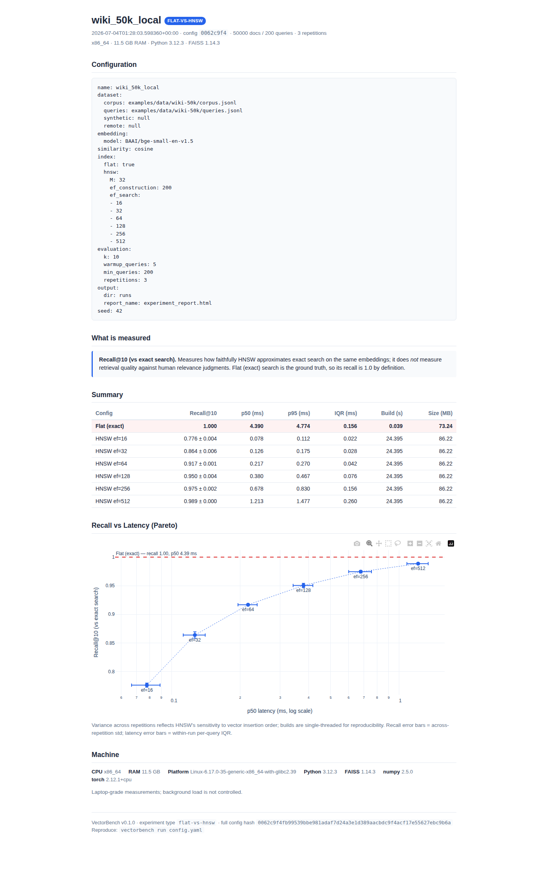

# VectorBench

**Design, run, compare, and visualize retrieval experiments on your own data.**

VectorBench is an experimentation platform for retrieval pipelines. You describe an
experiment in a small YAML file, run one command, and get a single self-contained HTML
**Experiment Report** — with honest error bars — that you can email, screenshot, or gist.

v0.1 ships the first experiment type: **Flat vs HNSW** — an exact-search baseline against
FAISS's HNSW index, sweeping `efSearch` with repetitions so every point carries a real
error bar, plotted as a Recall-vs-Latency Pareto chart.

> Recall here is measured **against exact search on the same embeddings** — how faithfully
> HNSW approximates a brute-force nearest-neighbour search. It is *not* a measure of
> retrieval quality against human relevance judgments.

<p align="center">
  
  <br>
  <em>A single self-contained Experiment Report — config, summary, and a Recall-vs-Latency Pareto chart with honest error bars. (50K real Wikipedia docs; see <a href="#results--50k-wikipedia-real-bge-small-embeddings">Results</a>.)</em>
</p>

---

## Install

```bash
python -m venv .venv && source .venv/bin/activate
pip install -e .
```

Tested on macOS and Linux. Windows via WSL2.

## Quickstart

Bundled configs, each with a distinct role:

```bash
# 1. Synthetic vectors (10K) — smoke test / CI. Zero network, ~30s single-threaded.
#    Semantics are meaningless (random vectors); use it to check the pipeline works.
vectorbench run examples/quickstart.yaml

# 2. Bundled small real-text corpus (SciFact, 5,183 abstracts) — fast, fully offline
#    real-embedding run. Latency spread is small at this scale (expected).
vectorbench run examples/scifact-small.yaml

# 3. Real 50K corpus, built locally from Simple English Wikipedia — the first config
#    with a visible Flat-vs-HNSW gap on real semantics. Build the corpus once, then run:
python scripts/build_wiki_50k.py           # → examples/data/wiki-50k/ (git-ignored, ~28MB)
vectorbench run examples/wiki-50k-local.yaml

# 4. The same real 50K corpus, downloaded from a checksum-pinned release asset and
#    cached — the shippable flagship; needs no local build step.
vectorbench run examples/benchmark-50k.yaml
```

Each run writes a self-describing folder under `runs/`:

```
runs/<timestamp>_<shorthash>/
  experiment_report.html   # the Experiment Report — open it in any browser, offline
  results.json             # raw per-rep numbers (schema_version: 1)
  config.yaml              # the resolved config as actually run
  metadata.json            # experiment type, hashes, machine info, versions
```

The last line the CLI prints is the path to the Experiment Report.

## Datasets

| Config | Corpus | Size | Source | Role |
|---|---|---|---|---|
| `quickstart.yaml` | Synthetic random vectors | 10K vecs / 500 queries | Generated locally | Smoke test, CI. ~30s single-threaded, zero network. |
| `scifact-small.yaml` | SciFact abstracts (real) | 5,183 docs / 300 queries | Bundled in repo (CC BY-SA 4.0) | Fast real-embedding run, fully offline. |
| `wiki-50k-local.yaml` | Simple English Wikipedia (real) | 50,000 docs / 200 queries | Built locally by `scripts/build_wiki_50k.py` (CC BY-SA 4.0) | First real Flat-vs-HNSW gap at scale. Corpus is git-ignored (local-only). |
| `benchmark-50k.yaml` | Simple English Wikipedia (real) | 50,000 docs / 200 queries | Downloaded from a checksum-pinned GitHub release asset (`data-v1`), cached | The shippable flagship — same corpus as `wiki-50k-local`, no local build step. |

## Results — 50K Wikipedia (real `bge-small` embeddings)

The first run on a real 50K corpus (`wiki-50k-local.yaml`, dim 384, k=10, 3 repetitions).
It produces the clean recall-vs-latency trade-off that the tiny and synthetic corpora
cannot show:

**Flat (exact ground truth):** recall 1.000 · p50 **4.39 ms** · index 73 MB

**HNSW** (M=32, ef_construction=200 · build ~24 s/rep · index 86 MB):

| efSearch | recall@10 (mean ± std) | p50 latency | speedup vs Flat |
|---:|:--|:--:|:--:|
| 16  | 0.776 ± 0.004 | 0.078 ms | 56× |
| 32  | 0.864 ± 0.006 | 0.126 ms | 35× |
| 64  | 0.917 ± 0.001 | 0.217 ms | 20× |
| 128 | 0.950 ± 0.004 | 0.380 ms | 12× |
| 256 | 0.975 ± 0.002 | 0.671 ms | 6.5× |
| 512 | 0.989 ± 0.000 | 1.20 ms  | 3.7× |

**How to read it:** the knee sits around `efSearch` 64–128 — at ef=128 you get 95% recall
for ~12× the throughput of exact search; push to ef=256 for 97.5% at 6.5×. Error bars are
tight (std ≤ 0.006 across three insertion-order-shuffled, single-threaded builds), so the
curve is signal, not measurement noise.

**Honest caveat (see "Known limitations"):** at 50K docs the exact-search baseline is only
4.39 ms, so the *absolute* time saved is sub-perceptible. HNSW's real payoff is at
1M+ documents where brute force climbs into tens/hundreds of ms. This run proves the
*shape* of the trade-off convincingly; it does not yet showcase HNSW at the scale where it
matters most.

## What you get

- **Recall@k (vs exact search)** with across-repetition error bars.
- **p50 / p95 / IQR latency**, single-threaded and warm, measured per query.
- **Index build time** and **on-disk size**.
- A **Recall-vs-Latency Pareto chart** with an identifiable `efSearch` knee.
- A **content-aware config hash** (config + corpus + queries + model + FAISS version) so a
  run is reproducible and identifiable.

Repetitions shuffle the vector insertion order (`seed + rep`) and build single-threaded, so
the variance you see reflects HNSW's genuine sensitivity to insertion order — not noise.

## Project status

**Working today (v0.1, validated):**
- Flat-vs-HNSW experiment type, end-to-end: config → embed → build → sweep → report.
- Four corpora wired and validated (see table): synthetic 10K, SciFact 5K, Wikipedia 50K
  (local build **and** as a downloadable checksum-pinned release asset).
- Self-contained HTML report, `results.json` (schema v1), content-aware hashing, run folders.
- 39 tests (`pytest`, <1s, no network); CI on Ubuntu + macOS.

**In progress / good pickups for other devs** (roughly ordered by effort):

1. **Scale the corpus to 250K–1M docs** for a dramatic latency gap. Simple English
   Wikipedia caps at ~240K articles; full English Wikipedia has millions.
   `scripts/build_wiki_50k.py` generalizes — bump `N_DOCS` and point at the full dump.
   This is what turns the "12× speedup" story into a "100×+" one (see Known limitations).
2. **Tune the HNSW build** (higher `M` / `ef_construction`) to push the recall ceiling past
   the current 0.989 at ef=512.
4. **Experiment Registry:** `list` / `compare` / `export` across runs. Every run folder
   already records its `experiment_type`, so the registry can be type-aware from day one.
5. **New experiment types** on the same engine + run-folder format: embedding comparison,
   vector-DB comparison, chunking, hybrid search, RAG evaluation. See
   [docs/ROADMAP.md](docs/ROADMAP.md).

### Known limitations

- **50K is small for HNSW.** The exact-search baseline (4.39 ms) is fast enough that the
  absolute latency win is imperceptible; HNSW's advantage grows with corpus size. Fix =
  pickup #1 above.
- **Recall tops out at 0.989** (ef=512) with the current build config — there's headroom
  via pickup #2.
- **`scripts/build_wiki_50k.py`** streams from the HF Hub and prints a benign
  `PyGILState` error at interpreter teardown *after* all files are written — the corpus is
  complete; ignore it. (Contributions to silence it cleanly welcome.)

## Roadmap

VectorBench is built to grow one **experiment type** at a time on the same engine and the
same run-folder format. See [docs/ROADMAP.md](docs/ROADMAP.md).

## License

MIT (code). Dataset licences are documented separately per corpus — see
[docs/DATASET_LICENSES.md](docs/DATASET_LICENSES.md).
